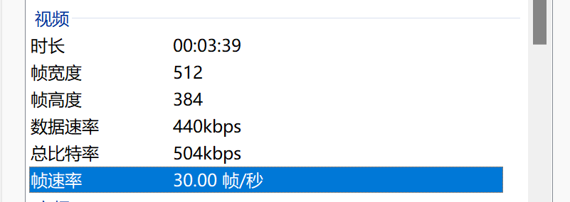

# badapple_on_CCaption
在CC字幕上观看badapple
# 如何使用
## 第一步，准备你的视频文件和ffmpeg
你可以从[这里](https://ffmpeg.org/)下载ffmpeg，并且按照网上的教程将ffmpeg添加到你的环境变量。 
接着，从[这里](https://www.bilibili.com/video/BV1xx411c79H/)下载badapple的PV，您需要注意，下载的视频的帧率必须为30.00帧每秒，不然可能会导致处理出来的画面有延迟。 

